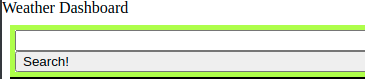
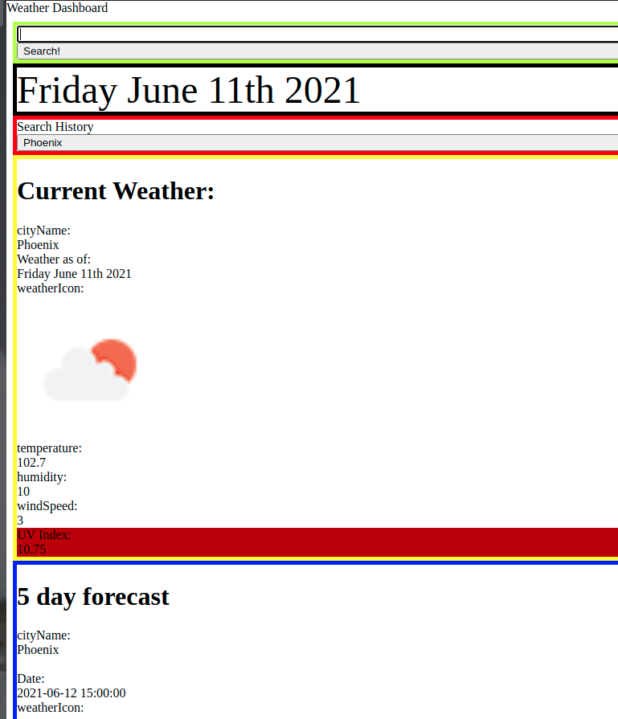

# weather-dashboard

<!--
*** Thanks for checking out the Best-README-Template. If you have a suggestion
*** that would make this better, please fork the repo and create a pull request
*** or simply open an issue with the tag "enhancement".
*** Thanks again! Now go create something AMAZING! :D
***
*** Forked from othneildrew/Best-README-Template
***
*** To avoid retyping too much info. Do a search and replace for the following:
*** github_username, repo_name, twitter_handle, email, project_title, project_description
*** tbegush, weather-dashboard, @tbegush, tbegush@gmail.com, weather-dashboard, A search for github repositories!
-->


<!-- PROJECT SHIELDS -->
<!--
*** I'm using markdown "reference style" links for readability.
*** Reference links are enclosed in brackets [ ] instead of parentheses ( ).
*** See the bottom of this document for the declaration of the reference variables
*** for contributors-url, forks-url, etc. This is an optional, concise syntax you may use.
*** https://www.markdownguide.org/basic-syntax/#reference-style-links
-->
[![Contributors][contributors-shield]][contributors-url]
[![Forks][forks-shield]][forks-url]
[![Stargazers][stars-shield]][stars-url]
[![Issues][issues-shield]][issues-url]
[![MIT License][license-shield]][license-url]
[![LinkedIn][linkedin-shield]][linkedin-url]


<!-- PROJECT LOGO -->
<br />
<p align="center">
  <a href="https://github.com/tbegush/weather-dashboard">
    
  </a>

  <h3 align="center">weather-dashboard</h3>

  <p align="center">
    A search for github repositories!
    <br />
    <a href="https://github.com/tbegush/weather-dashboard"><strong>Explore the docs »</strong></a>
    <br />
    <br />
    <a href="https://tbegush.github.io/weather-dashboard/">View Demo</a>
    ·
    <a href="https://github.com/tbegush/weather-dashboard/issues">Report Bug</a>
    ·
    <a href="https://github.com/tbegush/weather-dashboard/issues">Request Feature</a>
  </p>
</p>


<!-- TABLE OF CONTENTS -->
<details open="open">
  <summary><h2 style="display: inline-block">Table of Contents</h2></summary>
  <ol>
    <li>
      <a href="#about-the-project">About The Project</a>
      <ul>
        <li><a href="#built-with">Built With</a></li>
      </ul>
    </li>
    <li>
      <a href="#getting-started">Getting Started</a>
      <ul>
        <li><a href="#prerequisites">Prerequisites</a></li>
        <li><a href="#installation">Installation</a></li>
      </ul>
    </li>
    <li><a href="#usage">Usage</a></li>
    <li><a href="#roadmap">Roadmap</a></li>
    <li><a href="#contributing">Contributing</a></li>
    <li><a href="#license">License</a></li>
    <li><a href="#contact">Contact</a></li>
    <li><a href="#acknowledgements">Acknowledgements</a></li>
  </ol>
</details>


<!-- ABOUT THE PROJECT  -->
## About The Project



Here's a blank template to get started:
**To avoid retyping too much info. Do a search and replace with your text editor for the following:**
`tbegush`, `weather-dashboard`, `@tbegush`, `tbegush@gmail.com`, `weather-dashboard`, `A search for github repositories!`


### Built With

* [HTML5]()
* [JavaScript]()
* [CSS]()


<!-- GETTING STARTED -->
## Getting Started

To get a local copy up and running follow these simple steps.

### Prerequisites

NONE

### Installation

1. Clone the repo
   ```sh
   git clone https://github.com/tbegush/weather-dashboard.git
   ```


<!-- USAGE EXAMPLES -->
## Usage

https://tbegush.github.io/weather-dashboard/


<!-- ROADMAP -->
## Roadmap

See the [open issues](https://github.com/tbegush/weather-dashboard/issues) for a list of proposed features (and known issues).


<!-- CONTRIBUTING -->
## Contributing

Contributions are what make the open source community such an amazing place to be learn, inspire, and create. Any contributions you make are **greatly appreciated**.

1. Fork the Project
2. Create your Feature Branch (`git checkout -b feature/AmazingFeature`)
3. Commit your Changes (`git commit -m 'Add some AmazingFeature'`)
4. Push to the Branch (`git push origin feature/AmazingFeature`)
5. Open a Pull Request


<!-- LICENSE -->
## License

Distributed under the MIT License. See `LICENSE` file for more information.


<!-- CONTACT -->
## Contact

Thomas Begush - [@tbegush](https://twitter.com/tbegush) - tbegush@gmail.com - 

Project Link: [https://github.com/tbegush/weather-dashboard](https://github.com/tbegush/weather-dashboard)


<!-- ACKNOWLEDGEMENTS -->
## Acknowledgements

* [https://github.com/othneildrew/Best-README-Template](https://github.com/othneildrew/Best-README-Template)
* []()
* []()


<!-- MARKDOWN LINKS & IMAGES -->
<!-- https://www.markdownguide.org/basic-syntax/#reference-style-links -->
[contributors-shield]: https://img.shields.io/github/contributors/tbegush/weather-dashboard.svg?style=for-the-badge
[contributors-url]: https://github.com/tbegush/weather-dashboard/graphs/contributors
[forks-shield]: https://img.shields.io/github/forks/tbegush/weather-dashboard.svg?style=for-the-badge
[forks-url]: https://github.com/tbegush/weather-dashboard/network/members
[stars-shield]: https://img.shields.io/github/stars/tbegush/weather-dashboard.svg?style=for-the-badge
[stars-url]: https://github.com/tbegush/weather-dashboard/stargazers
[issues-shield]: https://img.shields.io/github/issues/tbegush/weather-dashboard.svg?style=for-the-badge
[issues-url]: https://github.com/tbegush/weather-dashboard/issues
[license-shield]: https://img.shields.io/github/license/tbegush/weather-dashboard.svg?style=for-the-badge
[license-url]: https://raw.githubusercontent.com/tbegush/weather-dashboard/master/LICENSE
[linkedin-shield]: https://img.shields.io/badge/-LinkedIn-black.svg?style=for-the-badge&logo=linkedin&colorB=555
[linkedin-url]: https://linkedin.com/in/tbegush
